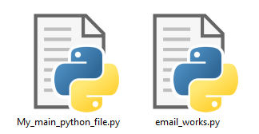

# email_works
Easy module for working with mail based on smpt and gmail<br>
Uses ssl connection on port 465

## Install important libraries
###### All tested on python 3.8.5
Update pip
```shell
python -m pip install --upgrade pip
```
Install libraries
```shell
pip install smtplib
pip install email
pip install urllib
pip install datetime
```

## Import this module
###### 1. put email_works.py in derictory with your main file
It must looks like this:


###### 2. Just import it!
```python
import email_works
```
## Change message information
```python
email_works.sender = "your@gmail.com"        # your email
email_works.receiver = "somebody@gmail.com"  # receiver email
email_works.password = "your_password_here"  # your password
```

## Send message with text
```python
email_works.send(
header="Email_works test 1",   # header of message
text="Hello, world!",          # message text
)
```
It looks like this:


## Send message with html
```python
email_works.send(
header="Email_works test 2",   # header of message
html="""
<html>
  <body>
    <a href="https://github.com/NVcoder24/email_works">Email works on github</a>
  </body>
</html>
"""                            # some html
)
```
It looks like this:


## Send message with website page (BETA)
This method extract html from web page deletes all trash and display it as html.<br>
It works bad currently<br>
I use this way because <iframe> is disabled in email
```python
email_works.send(
header="Email_works test 2",                    # header of message
url="https://github.com/NVcoder24/email_works"  # url to the web page
)
```
###### JS and other things will not working

## Logging
In default it turned off
###### On
```python
email_works.logging = True   # turn on logging
```
###### Off
```python
email_works.logging = False  # turn off logging
```

## How to check emails and your password
```python
print("your mail: {sender}\nreceiver mail: {receiver}\npassword: {password}".format(sender=email_works.sender, receiver=email_works.receiver, password=email_works.password))
```
